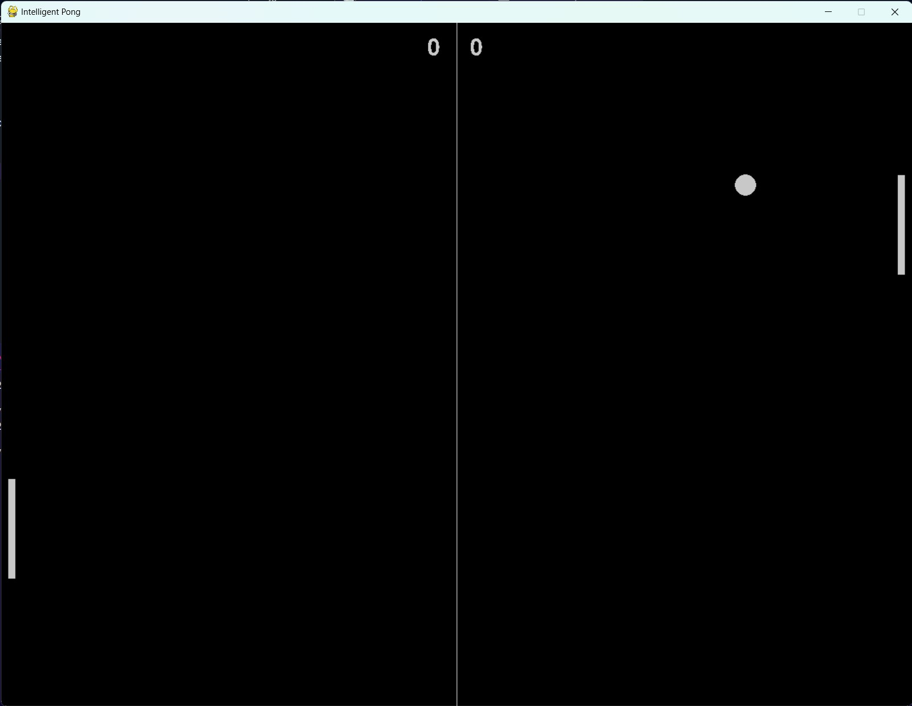

# Proyecto Machine Learning 2022

Pablo Sauma Chacón

- [Proyecto Machine Learning 2022](#proyecto-machine-learning-2022)
  - [Estudiantes](#estudiantes)
  - [Enunciado](#enunciado)
  - [Descripción del Juego](#descripción-del-juego)
    - [Manual de Usuario](#manual-de-usuario)
    - [Implementación de Aprendizaje Mecánico](#implementación-de-aprendizaje-mecánico)
    - [Carácteristicas del Agente](#carácteristicas-del-agente)
  - [Problemas y Desafios](#problemas-y-desafios)
  - [Resultados](#resultados)

## Estudiantes

- Marco Ferraro Rodriguez
- Roy Padilla Calderón

## Enunciado

Este proyecto consiste en implementar un modelo de inteligencia artificial para algún juego de mesa o digital previamente aprobado por el profesor.

## Descripción del Juego

Para este proyecto se decidió implementar una versión del juego Pong. Pong es un juego inspirado en el tennis de messa, en el cual un jugador mueve su paleta de manera vertical para poder hacer contacto con una bola en movimiento.

El objetivo del juego consiste envitar que la pelota toque la pared defendida por uno y realizar más puntos que el oponente.

### Manual de Usuario

El programa se desarrolló utilizando la libreria Pygame. Esta libreria ofrece módulos y herramientas para el desarrollo de juegos con Python. Para inicializar el programa se ejecuta el `main.py`. Al inicializar el programa se encontrá un menú con varias opciones.

La primera opción consiste en un modo de Jugador 1 contra Jugador 2. El jugador 1 utilizará las flechas de arriba y abajo para mover si paleta, mientras que el jugador 2 utilizará las teclas `w` y `s`.

La opción 2 y 3 son muy similares, ya que se introduce el uso de un agente inteligente.

Sin embargo, cabe destacar que la opción 4, denominada **The Training Center**, es un modo en donde el agente inteligente estará aprendiendo a desenvolverse en el ambiente.

En este modo, el agente inteligente jugará de forma automatica, sin embargo, para acelerar el proceso de aprendizaje se pueden agregar `n` cantidad de simulaciones en la cajita y acelerar el proceso.

### Implementación de Aprendizaje Mecánico

Para la implementación del aprendizaje se utilizó la técnica de _Deep-Q Learning_. Dentro de esta metodología se utilizó una red neuronal con una capa de entrada, una intermedia y una de salida. Mediante la siguiente configuración:

-Capa de entrada de 3 neuronas las cuales representan un estado.

-Capa intermedia de 128 neuronas con activación Tangente hiperbólico para tener valores tando positivos como negativos (de -1 a 1).

-Capa de salida con activación Leaky Relu para la aproximación de los valores Q con 2 neuronas las cuales representan los dos movimientos disponibles de la paleta (arriba y abajo).

Se utilizó la siguiente representación de un estado para cada jugador para el algoritmo de _Deep-Q Learning_:

`(Distancia Coordenada Y de la paleta hacia la bola, Posición Coordenada Y de la paleta, Coordenada Y de la paleta rival)`

### Carácteristicas del Agente

El agente inteligente tendrá tres opciones disponibles; moverse para arriba o para abajo. El agente decidirá y ejecutará una de estas acción. Cada agente generará una salida del estado, asi como su valor respectivo de recompensa. La entrada de cada agente será la acción determinada por el modelo de aprendizaje mecánico.

## Problemas y Desafios

-En el entrenamiento dado que la bola tiene un comportamiento continuo genera un problema de tiempo al calcular la recompensa para momentos cortos como el tocar la paleta, ya que el llamado al cálculo de esta puede no darse en el momento justo que se da la acción de la bola y la paleta.

-Tiempos de entrenamientos altos ya que un escenario puede tardar entre 4 segundos a 10 segundos aproximadamente.

## Resultados
[(https://youtu.be/zazxN9fcpT8)]
